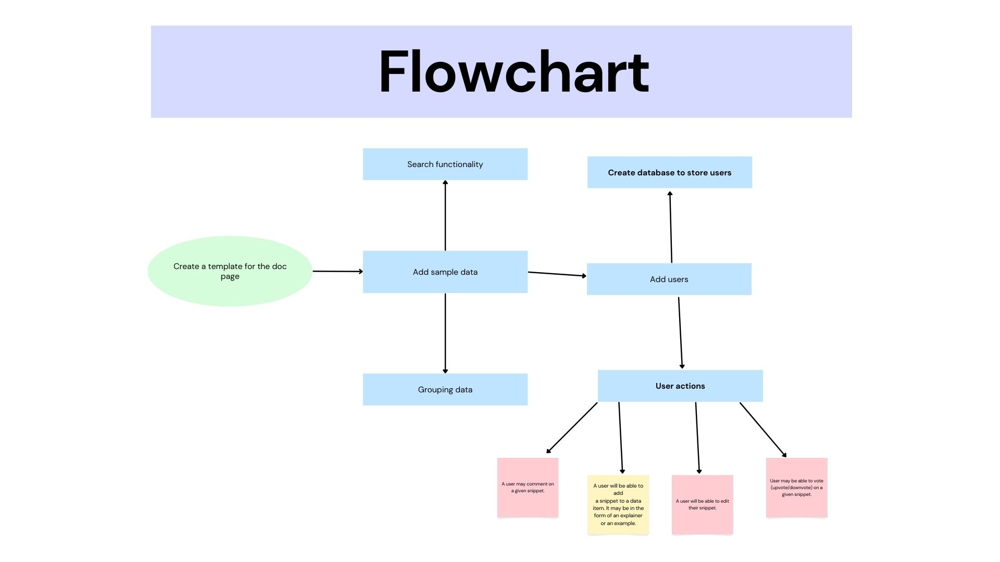

# CBP11 Empowering Python Developers: A Comprehensive Solution for Documentation Consolidation and Collaboration

 An interactive python docs created by developers for developers. Users will be able to add, modify and vote for the best documentation. Leaderboard for best contributors.

## Functions
1. Fetch doc item from the database : 
2. Search a doc item 
3. Creation a doc item by a user
4. Creation of a snippet for a given doc item
5. Ability to vote (upvote/downvote)
6. Sorting snippets on the basis of votes
7. Adding comments to a snippet

### Flowchart
